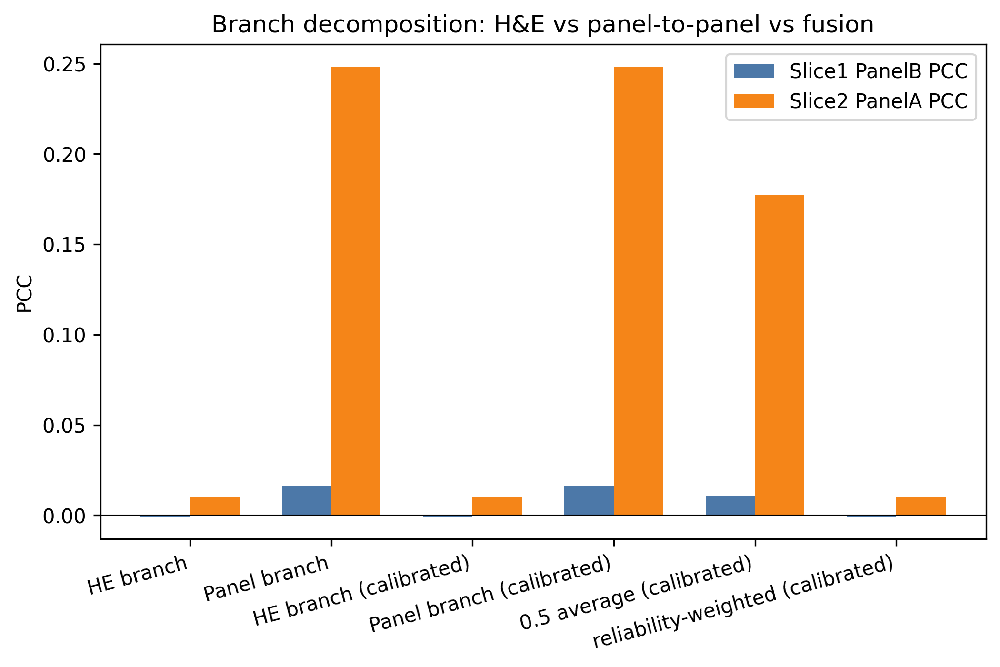

# Fig.3 架构 × 监督信号排列组合与实验结果

> 数据：Xenium Human Breast Cancer Rep1/Rep2，`data/panel_split_official.csv`（150 panelA / 163 panelB）。  
> 评估指标：gene-level PCC（Slice1 预测 PanelB，Slice2 预测 PanelA）。  
> 训练默认 500 epochs（MLP MNN 脚本为 300 epochs），hidden=512（GT 为 128-d）。

---

```md
1. 任务背景与 strict 协议
   ↓
2. 第一次尝试：改进网络架构（GT 替代 HGNN）
   → 结果：基本持平，没有优势
   ↓
3. 诊断：分支贡献分析（Branch Decomposition）
   → 发现：H&E branch 接近 0，panel branch dominant
   → 结论：瓶颈不在网络架构，而在监督信号
   ↓
4. 第二次尝试：改进监督信号（Strict MNN 替代 Cycle）
   → Cycle self-consistency trap
   → Strict MNN 机制
   → 结果：显著提升
   ↓
5. 结果总表与排列组合解读
   ↓
6. 结论与展望
```


## 1. 任务协议

### 1.1 Strict Fig.3（当前主 benchmark）

与论文 Fig.3 一致，**不使用 held-out panel**：

| 切片   | 可用           | 仅评估  |
| ------ | -------------- | ------- |
| Slice1 | $X_1$, $Y_A^1$ | $Y_B^1$ |
| Slice2 | $X_2$, $Y_B^2$ | $Y_A^2$ |

Strict MNN 伪标签构造：

- Slice1 pseudo-$B$：**H&E 跨切片 MNN**（$X_1\leftrightarrow X_2$），转移 $Y_B^2$
- Slice2 pseudo-$A$：**B-panel 跨切片 MNN**（$Y_B^2\leftrightarrow$ pseudo-$Y_B^1$），转移 $Y_A^1$

### 1.2 Oracle MNN（已废弃，仅作对照）

早期实现用 $Y_A^2$ 做 A1↔A2 matching（Slice2 上本不应可见），在 official split 上 PCC 虚高。**后续实验均以 strict 为准。**

---

## 2. 仓库内组合空间

### 2.1 编码器轴

| 名称             | 类 / 脚本                    | 说明                                |
| ---------------- | ---------------------------- | ----------------------------------- |
| HGNN             | `SpatialExP`                 | 官方 SpatialEx+，512-d              |
| HGNN-small       | `SpatialExP_Small`           | 128-d 容量对齐                      |
| GT               | `SpatialExP_GT`              | Graph Transformer + MFP，128-d 稳定 |
| HGNN-conditional | `SpatialExP_Conditional`     | HGNN + [H&E, measured panel] 输入   |
| HGNN-MNN         | `SpatialExP_ConditionalHGNN` | HGNN + strict MNN 伪标签            |
| GT-MNN           | `SpatialExP_ConditionalGT`   | GT + strict MNN 伪标签              |
| MLP              | `SpatialExP_ConditionalMLP`  | 2-layer MLP                         |

### 2.2 监督 / 匹配轴

| 名称           | 实现                                | 匹配空间                           | 接入模型        |
| -------------- | ----------------------------------- | ---------------------------------- | --------------- |
| Cycle          | `SpatialExP` / `SpatialExP_GT`      | 同切片 A↔B 重建 + 跨切片 cycle     | HGNN / GT       |
| Cycle-only MLP | `SpatialExP_ConditionalCycleMLP`    | 仅 measured-panel cycle + 分布匹配 | MLP             |
| H&E kNN        | `SpatialExP_Conditional`            | H&E 跨切片 kNN                     | HGNN            |
| Strict raw kNN | `run_fig3_mnn_pseudo.py`            | H&E bridge + B-panel bridge        | MLP             |
| Strict MNN     | `build_strict_mnn_pseudo_labels`    | 同上 + MNN 过滤                    | MLP / HGNN / GT |
| MNN + Cycle    | `SpatialExP_ConditionalMNNCycleMLP` | strict MNN 监督 + cycle 正则       | MLP             |
| Latent MNN     | `run_fig3_latent_mnn.py`            | H&E PCA/CORAL + MNN                | MLP             |

---

## 3. Official split 结果总表（gene-level PCC）

### 3.1 Strict 协议（Fig.3 合规）

| 编码器   | 监督                 | Slice1 PCC | Slice2 PCC | 输出目录                                    |
| -------- | -------------------- | ---------: | ---------: | ------------------------------------------- |
| HGNN     | Cycle                |      0.275 |      0.301 | `fig3_spatialexp_official`                  |
| GT-128   | Cycle                |      0.267 |      0.276 | `fig3_spatialexp_gt_official`               |
| MLP      | Strict raw kNN       |      0.327 |      0.381 | `fig3_mnn_pseudo_strict_official`           |
| MLP      | **Strict MNN**       |  **0.334** |  **0.371** | `fig3_mnn_pseudo_strict_official`           |
| MLP      | Strict MNN + Cycle   |      0.315 |      0.353 | `fig3_mnn_cycle_strict_official`            |
| MLP      | Cycle only（无 MNN） |      0.005 |      0.013 | `fig3_conditional_cycle_strict_official`    |
| GT-128   | Strict MNN           |      0.258 |      0.289 | `fig3_conditional_gt_mnn_strict_official`   |
| HGNN-512 | Strict MNN           |      0.234 |      0.273 | `fig3_conditional_hgnn_mnn_strict_official` |

> MLP strict MNN 脚本训练 300 epochs；其余多为 500 epochs。

在这一节的结果中, 对比HGNN-512+cycle 和 HGNN-512 + MNN 的结果, 发现cycle的PCC和SSIM更强, 推测cycle能够加强HGNN对自身空间的感知. 而HGNN-512+cycle 和 MLP + cycle 的结果对比, 可以看到在没有感知到空间信息的时候, 自环只会加强噪音. 进一步地, MLP+MNN 的结果表明, MLP本身没有感知within-panel的空间信息, 而是依靠MNN 学习到了跨panel的空间信息. 所以, MNN的作用是提供跨panel的空间信息, cycle 则是加强架构本身学习到的空间信息. 然后, HGNN-512 的信息和MNN的信息相互混合的时候, 可能反而没有HGNN-512 自身的空间信息那么明确, 所以HGNN-512+cycle 比 HGNN-512 + MNN 表现好. 
 
### 3.2 Oracle MNN（使用了 $Y_A^2$，**不作主结论**）

| 编码器   | 监督       | Slice1 PCC | Slice2 PCC | 输出目录                             |
| -------- | ---------- | ---------: | ---------: | ------------------------------------ |
| MLP      | Oracle MNN |      0.441 |      0.480 | `fig3_mnn_pseudo_official`           |
| GT-128   | Oracle MNN |      0.319 |      0.348 | `fig3_conditional_gt_mnn_official`   |
| HGNN-512 | Oracle MNN |      0.303 |      0.329 | `fig3_conditional_hgnn_mnn_official` |

### 3.3 Random split（机制诊断，非论文 split）

| 编码器 | 监督       | Slice1 PCC | Slice2 PCC |
| ------ | ---------- | ---------: | ---------: |
| HGNN   | Cycle      |         ~0 |         ~0 |
| MLP    | Oracle MNN |     ~0.015 |     ~0.265 |
| MLP    | Cycle only |         ~0 |         ~0 |

Random split 下 Slice1 信息桥极弱；official split 两方向均可解。

---

## 4. 排列组合解读

### 4.1 监督信号：MNN ≫ Cycle（strict 设定下）

```
Cycle only (MLP)     : 0.005 / 0.013   ← 接近随机，cycle self-consistency trap
HGNN/GT + Cycle      : 0.27  / 0.30    ← 论文方法线，无伪标签
MLP + Strict MNN     : 0.334 / 0.371   ← 当前 strict 最优
MLP + MNN + Cycle    : 0.315 / 0.353   ← 加 cycle 略降，与 MNN 冲突
```

**结论**：在 strict Fig.3 下，跨切片伪标签是主要有效监督；纯 cycle 无法恢复 missing panel，与 MNN 叠加亦无增益。

### 4.2 编码器：同监督下 MLP > GT > HGNN（strict MNN）

| 监督       | MLP               | GT-128        | HGNN-512      |
| ---------- | ----------------- | ------------- | ------------- |
| Strict MNN | **0.334 / 0.371** | 0.258 / 0.289 | 0.234 / 0.273 |
| Cycle      | — / —             | 0.267 / 0.276 | 0.275 / 0.301 |

Graph 模型 + MNN 未超过纯 MLP；HGNN conditional 的 SSIM 明显偏低（~0.05），空间结构保真差。

### 4.3 Oracle vs Strict：信息预算影响

Official split 上，去掉 $Y_A^2$ oracle 对齐后，MLP PCC 从 ~0.44/0.48 降至 ~0.33/0.37（约 −0.10），仍高于 Cycle baseline。

### 4.4 分支贡献辨析（Branch Decomposition）

为了理解 SpatialEx+ 内部 H&E branch 与 panel-to-panel branch 各自贡献了多少有效信号，我们将最终预测拆成两条独立路径：

- **H&E-driven branch**：只使用 H&E 图像特征预测缺失 panel：
  $$
  \hat{Y}_{B,X}^{1}=F_B(X_1),\qquad \hat{Y}_{A,X}^{2}=F_A(X_2).
  $$

- **Panel-to-panel branch**：只使用已测 panel 经过 translator 预测缺失 panel：
  $$
  \hat{Y}_{B,C}^{1}=C_{A\rightarrow B}(Y_A^1),\qquad
  \hat{Y}_{A,C}^{2}=C_{B\rightarrow A}(Y_B^2).
  $$

进一步构造简单融合：
$$
\hat{Y}_{B,\text{ens}}^{1}=\alpha \hat{Y}_{B,X}^{1}+(1-\alpha)\hat{Y}_{B,C}^{1},
$$
Slice2 方向同理。

> 注：以下分支分解实验在随机 150/163 gene split 设置下完成，见 [`repo.6.16.md`](repo.6.16.md)。其定性结论（H&E branch 弱、panel branch dominant、late fusion 有害）对 official split 同样成立。

| Variant                           | Slice1 PanelB PCC | Slice2 PanelA PCC |
| --------------------------------- | ----------------: | ----------------: |
| H&E branch                        |            -0.001 |             0.010 |
| Panel branch                      |         **0.016** |         **0.248** |
| 0.5 average (calibrated)          |             0.011 |             0.177 |
| Reliability-weighted (calibrated) |            -0.001 |             0.010 |



**结论**：
- H&E branch 在两个方向上 PCC 均接近 0；
- Panel branch 在 Slice2 方向达到 ~0.248，是主要有效信号；
- 简单平均 fusion 将 Slice2 从 0.248 拉低到 0.177，说明 H&E 分支对 panel-to-panel 信号是噪声而非补充；
- 这解释了为什么后续把 H&E 从 MLP 输入中拿掉后，Strict MNN 方法反而取得更好效果。

---

## 5. 与论文 DeepPT baseline 的关系

论文 Fig.3 对比对象是 **DeepPT**（H&E→omics，每 panel 独立训练），本仓库**尚未实现 DeepPT**。上表结果为内部对照：

- **SpatialEx+ Cycle**（HGNN/GT）≈ 论文方法线
- **MLP + Strict MNN** = 本仓库探索的轻量替代路线，不能直接与论文 DeepPT 数值比较

---

## 6. 推荐实验矩阵（后续优化）

在 **strict Fig.3 + official split** 约束下，优先扩展：

| 优先级 | 方向                                              | 理由                            |
| ------ | ------------------------------------------------- | ------------------------------- |
| 高     | MLP + Strict MNN 调参（$k$, $mnn\_k$, $\lambda$） | 当前 strict 最优                |
| 高     | GT/HGNN + Cycle（已有 baseline）                  | 论文方法线，架构差异明确        |
| 中     | GT + Strict MNN                                   | graph 模型 + 伪标签，略低于 MLP |
| 低     | MNN + Cycle                                       | 已证略有害                      |
| 低     | Cycle only                                        | 已证无效                        |

---

## 7. 运行命令速查

```bash
# Strict MNN + MLP
conda run -n spatialex python scripts/fig3/run_fig3_mnn_pseudo.py \
  --panel_csv data/panel_split_official.csv \
  --out_dir outputs/conditional/fig3_mnn_pseudo_strict_official

# HGNN / GT + Cycle
conda run -n spatialex python scripts/fig3/run_fig3_panel_split.py \
  --model spatialexp --panel_csv data/panel_split_official.csv \
  --out_dir outputs/conditional/fig3_spatialexp_official

# GT / HGNN + Strict MNN
conda run -n spatialex python scripts/fig3/run_fig3_panel_split.py \
  --model conditional_gt_mnn --hidden_dim 128 \
  --panel_csv data/panel_split_official.csv \
  --out_dir outputs/conditional/fig3_conditional_gt_mnn_strict_official

# MLP + Strict MNN + Cycle
conda run -n spatialex python scripts/fig3/run_fig3_panel_split.py \
  --model conditional_mnn_cycle_mlp \
  --panel_csv data/panel_split_official.csv \
  --out_dir outputs/conditional/fig3_mnn_cycle_strict_official

# MLP + Cycle only（无 MNN）
conda run -n spatialex python scripts/fig3/run_fig3_conditional_cycle.py \
  --panel_csv data/panel_split_official.csv --no_use_he \
  --out_dir outputs/conditional/fig3_conditional_cycle_strict_official
```

---

## 8. 代码入口

| 组合              | 核心文件                                                                   |
| ----------------- | -------------------------------------------------------------------------- |
| Strict MNN 伪标签 | `SpatialEx/SpatialEx_conditional_gt.py` → `build_strict_mnn_pseudo_labels` |
| HGNN/GT + MNN     | `SpatialEx_conditional_hgnn.py`, `SpatialEx_conditional_gt.py`             |
| MLP + MNN + Cycle | `SpatialEx_conditional_mnn_cycle_mlp.py`                                   |
| MLP + Cycle only  | `SpatialEx_conditional_cycle_mlp.py`                                       |
| 统一入口          | `scripts/fig3/run_fig3_panel_split.py`                                     |
