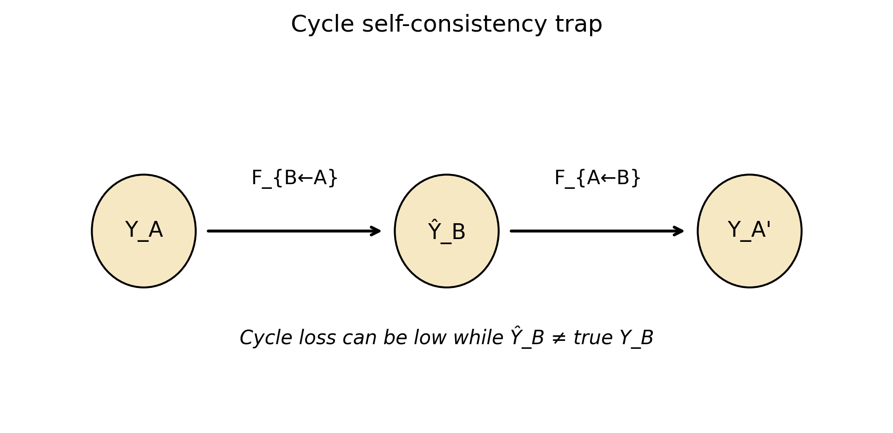
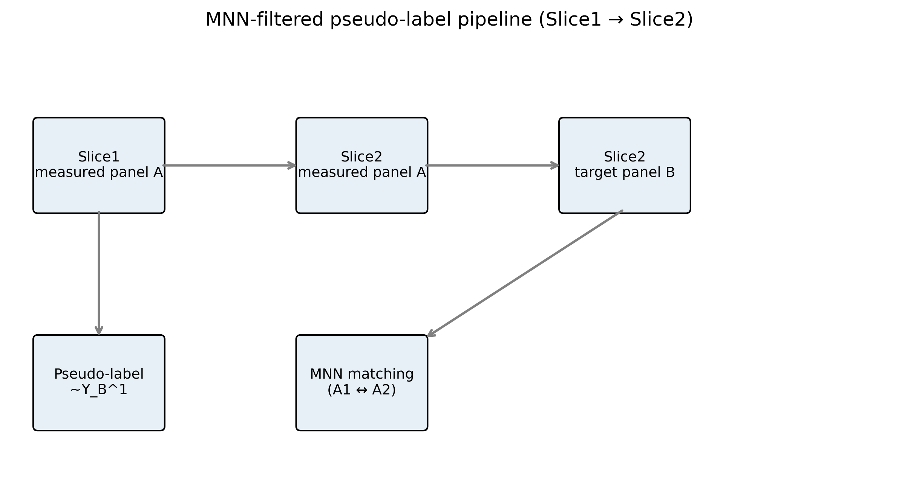
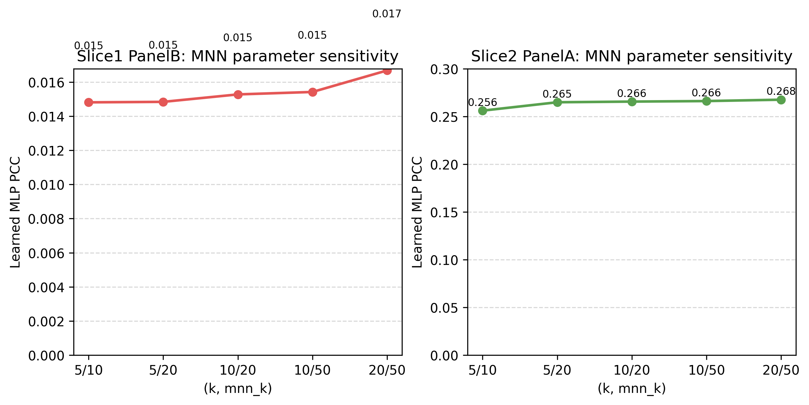
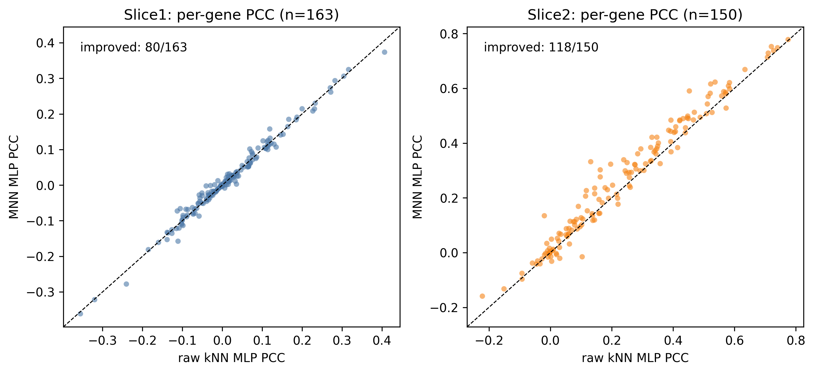
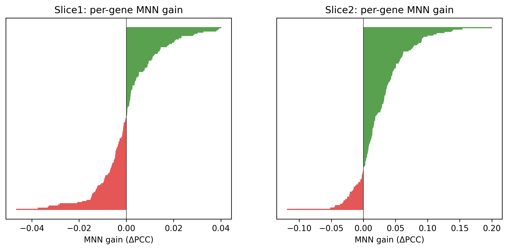
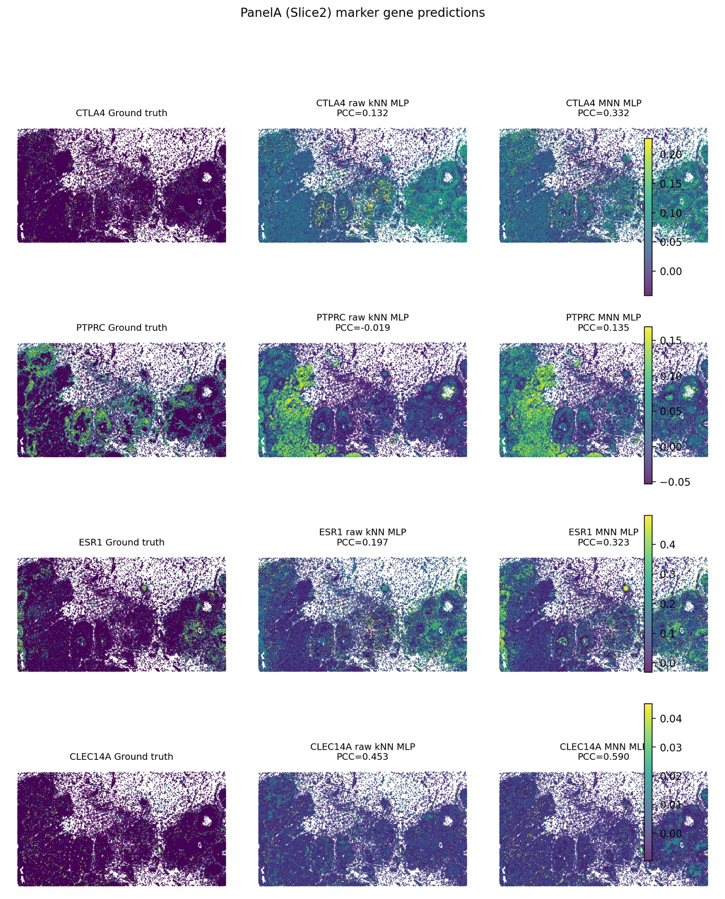
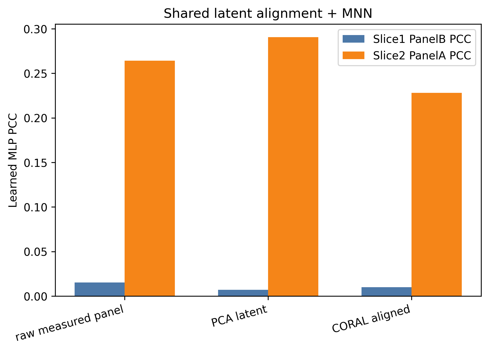

# SpatialEx 复现与改进报告6.16

> 内容提要: 本报告记录了对论文中SpatialExP的进一步诊断、机制拆解与改进工作, 主要围绕*Fig.3 panel diagonal integration* 任务展开。  
> 作者: 李熹鸣  
> TimeSpan: 6.10-6.16 
> 
> GitHub: [965120527lxm-maker/SpatialEvo](https://github.com/965120527lxm-maker/SpatialEvo)

在展开本周工作的汇报之前，我们先回顾一下上一阶段（repo.6.9）已经奠定的基础。我们完成了对 SpatialEx/SpatialEx+ 论文的阅读与代码复现，修复了官方实现中的 5 个关键运行时 bug，并在 Xenium Human Breast Cancer 的两个切片上跑通了原始模型，得到单切片 H&E-to-omics 预测 PCC 约 0.31 的基线。这说明官方代码链路本身可以运行，也为进一步分析 Fig.3 panel diagonal integration 提供了基础。

同时，我们也尝试了初步的架构改进，包括把 HGNN 替换为 Graph Transformer、用 MFP 取代 DGI、以及把 cross-attention translator 简化为轻量 MLP。受限于 RTX 5090 上的反向传播显存峰值，改进模型只能用 128 维隐藏空间运行，性能与 512 维的原始模型基本持平，未能形成明确的架构优势。

然而，panel diagonal integration 与常规单切片预测并不相同。它要求在两个相邻切片中，一张切片只测得 panel A，另一张切片只测得 panel B，然后用 H&E 与已测 panel 补全缺失 panel。由于缺失 panel 在训练时不可直接使用，该任务的难点不只在预测器本身，更在于监督信号从何而来。换言之，模型结构只是问题的一部分；pseudo-label、cycle consistency 或跨切片匹配关系是否可靠，才是影响预测结果的关键因素。

本工作正是围绕这一点展开.

围绕这一点，本文将原 SpatialEx+ 的信号来源拆解为三部分：H&E-driven branch、panel-to-panel branch 以及 cycle consistency 约束。实验显示，在当前 Rep1/Rep2 与随机 150/163 gene split 设置下，H&E 分支的跨切片泛化能力较弱，panel-to-panel 分支反而构成主要有效信号。进一步地，late fusion 并未带来互补增益，说明多模态融合并不天然有效；当某个模态在目标域中缺乏可迁移信息时，它可能更多地表现为噪声。

在此基础上，笔者进一步考察了跨切片 matching 的作用。MNN 过滤能在 Slice2 方向稳定提升 panel-to-panel MLP 的预测性能；若先将 measured panel 投影到 PCA latent space 后再做 MNN，Slice2 learned PCC 可进一步提升到约 0.291。但 Slice1 方向始终接近随机，这提示我们：matching 改进只能改善已有信息桥的方向，不能凭空创造缺失的生物学对应关系。

## 一、问题设定

不妨先形式化地描述 Fig.3 panel diagonal integration 的任务。设两个相邻切片分别记为 Slice1 与 Slice2。Slice1 中测得 panel A，缺失 panel B；Slice2 中测得 panel B，缺失 panel A。于是需要完成两项互补的补全任务：

* 对 Slice1，用 H&E 图像 $X_1$ 与已测 panel $Y_A^1$ 预测缺失 panel $\hat{Y}_B^1$；
* 对 Slice2，用 H&E 图像 $X_2$ 与已测 panel $Y_B^2$ 预测缺失 panel $\hat{Y}_A^2$。

若只从输入输出看，该问题似乎只是一个条件预测任务。然而需要指出的是，真实的 $Y_B^1$ 与 $Y_A^2$ 在训练中不可使用，否则就会造成 ground truth 泄漏。因此，任务的困难并不只是“选择一个足够强的神经网络”，而是必须回答：在缺少直接监督的情况下，模型到底依靠什么信号学习 missing panel？

原 SpatialEx+ 大体包含两条路径。第一条是 H&E-driven SpatialEx 路径，即直接用 H&E 图像预测 omics：

$$
F_B(X_1) \rightarrow \hat{Y}_B^1, \qquad F_A(X_2) \rightarrow \hat{Y}_A^2.
$$

第二条是 omics-cycle MLP 路径，即利用已测 panel 学习 panel 之间的映射：

$$
C_{A\rightarrow B}(Y_A^1) \rightarrow \hat{Y}_B^1, \qquad C_{B\rightarrow A}(Y_B^2) \rightarrow \hat{Y}_A^2.
$$

在论文方法中，omics-cycle 路径主要被用作 cycle regularization，而不是作为一个独立预测器来评价。本文的切入点正在于此：若将 H&E branch 与 panel branch 拆开，它们各自提供了多少有效信号？二者融合后是否真的互补？如果某一路径失效，失效原因来自模型表达能力、监督信号质量，还是跨切片匹配关系本身？

为避免两个切片拥有完全相同 313 个基因时 panel 翻译退化为恒等映射，笔者按照论文思路将 313 个基因随机划分为两个互补 panel，以模拟 no-co-measured 场景。接下来的分析均围绕这一设置展开。

## 二、从监督信号谈起

在 no-co-measured setting 下，不妨首先考察：缺失 panel 的监督信号可以从哪里获得？一条自然路径是构造跨切片 pseudo-label，另一条路径是借助 cycle consistency。本节先说明 pseudo-label 的构造方式及其跨方向不对称性，再考察把 H&E 与 measured panel 同时纳入预测的多模态条件预测器，最后诊断 cycle consistency 的局限性。

### 2.1 跨切片 pseudo-label 的构造与不对称性

一个直接的想法是，先在 Slice1 与 Slice2 的细胞之间建立对应关系，再把参考切片上已测的目标 panel 表达转移过来作为 pseudo-label。具体地，对 Slice1 中的每个细胞 $i$，在 Slice2 的 measured panel A 空间中寻找 $k$ 个最近邻，记为 $\mathcal{N}_k(i)$；然后用这些邻居在 panel B 上的表达平均值作为 $i$ 的 pseudo-label：

$$
\tilde{Y}_{B,i}^1 = \frac{1}{k}\sum_{j\in \mathcal{N}_k(i)} Y_{B,j}^2.
$$

同理可构造 Slice2 的 pseudo-label。这种 kNN pseudo-label 的质量可以直接用 PCC 衡量：若把 pseudo-label 本身当作预测结果，它在真实 missing panel 上能达到多少相关？这给出了一个 direct transfer quality baseline。

容易想到，上述对应关系可以在 measured panel 空间中计算，也可以在 H&E 特征空间中计算。诊断结果显示，H&E cross-slice pseudo-label 基本接近随机，PCC 约为 0；Slice1 的 $A_1\rightarrow A_2\rightarrow B_2$ 桥接非常弱，direct pseudo-label PCC 只有约 0.014；而 Slice2 的 $B_2\rightarrow \text{pseudo}B_1\rightarrow A_1$ 桥接较强，可以达到约 0.25。由此可见，两个方向并不对称，任务难度不仅由模型决定，也与 panel split 和跨切片生物信号桥接强度有关。

这一观察将问题从“如何设计更强预测器”转向了“如何获得更可信的监督信号”。若 pseudo-label 本身近似随机，后续模型很难凭空恢复真实表达结构。

### 2.2 多模态条件预测器

既然 measured panel 是主要匹配基础，下一个问题便是：如何把它与 H&E 图像一起纳入预测模型？一种做法是把 H&E 特征与 measured panel 拼接，作为 conditional predictor 的输入；另一种做法则像 SpatialEx+ 那样，让 H&E-driven branch 与 panel-to-panel branch 并存。本节先考察第一种做法，即多模态条件预测器。

笔者实现了两类条件预测器。第一类是轻量级 conditional MLP，其输入为 H&E 特征与 measured panel 的拼接；第二类是 conditional HGNN，在空间超图上同时聚合 H&E 与 measured panel 信息。由于真实 missing panel 不可用，训练目标仍采用跨切片 pseudo-label。表 1 给出了不同输入配置下的 PCC。

| Variant | Slice1 PanelB PCC | Slice2 PanelA PCC |
| --- | ---: | ---: |
| H&E only | 0.004 | 0.010 |
| conditional HGNN (H&E + panel) | −0.007 | −0.0002 |
| measured-panel MLP (panel only) | **0.016** | **0.260** |

由表 1 可见，仅使用 H&E 时两个方向都接近随机；加入 H&E 的 conditional HGNN 甚至略差于 panel-only MLP。这说明在当前设置下，把 H&E 与 measured panel 简单拼接并不能提升预测性能，H&E 特征对 missing panel 的跨切片预测没有提供明显补充。

进一步地，若比较 direct pseudo-label 与 learned MLP，可以发现二者非常接近（表 2）。

| Direction | Direct pseudo-label PCC | Learned MLP PCC |
| --- | ---: | ---: |
| Slice1 PanelA → PanelB | **0.014** | 0.016 |
| Slice2 PanelB → PanelA | **0.252** | 0.260 |

这提示我们，conditional MLP 的表达能力并非瓶颈；瓶颈在于 pseudo-label 本身的质量。换言之，多模态输入的引入并不能突破监督信号的上限。需要指出的是，direct pseudo-label 的具体数值会随近邻数 $k$ 与匹配策略略有变化，后文在 MNN 实验中将看到另一组 $k$ 下的结果。

### 2.3 Cycle consistency 的自洽陷阱

另一条思路是避免直接构造 pseudo-label，转而使用 SpatialEx+ 中的 cycle consistency。其基本想法是：先从已测 panel 预测缺失 panel，再从预测出的缺失 panel 重建原始 panel。若重建误差较小，似乎就说明中间预测具有某种合理性。

在本文实验中，conditional cycle 的预测形式可写为：

$$
\hat{Y}_B^1 = P_B(X_1) + F_{B\leftarrow A}(X_1,Y_A^1), \qquad
\hat{Y}_A^2 = P_A(X_2) + F_{A\leftarrow B}(X_2,Y_B^2).
$$

训练损失包括 cycle reconstruction loss、H&E anchor loss 以及 per-gene mean/std distribution matching。训练过程不使用 $Y_B^1$ 和 $Y_A^2$，因此形式上避免了 ground truth 泄漏。实验结果如下。

| 模型 | Slice1 PanelB PCC | Slice2 PanelA PCC |
| --- | ----------------: | ----------------: |
| measured-panel MLP (panel only) | **0.016** | **0.260** |
| conditional cycle H&E + anchor | 0.004 | 0.007 |
| conditional cycle panel-only | −0.004 | 0.002 |

虽然 cycle loss 能够下降，例如 panel-only 设置中从 1.19 降到 0.20，但最终预测结果仍接近随机。这说明模型学到的可能只是一个自洽的中间表示，而不一定是真实 missing panel。笔者将这一现象称为 **cycle self-consistency trap**：cycle 可以保证 $Y_A\rightarrow \hat{Y}_B\rightarrow Y_A'$ 的回环重建较好，却无法保证中间的 $\hat{Y}_B$ 接近真实的 $Y_B$。

> **图 1** Cycle self-consistency trap。Cycle loss 只约束 $Y_A \leftrightarrow \hat{Y}_B \leftrightarrow Y_A'$ 的重建误差，不约束 $\hat{Y}_B$ 与真实 $Y_B$ 的对应关系，因此模型可能学到自洽但无生物学意义的中间表示。

这一结果排除了一个直觉上很自然的可能性，即仅靠 cycle consistency 并不足以恢复真实 missing panel。若缺少外部锚点或可信 pseudo-label，cycle loss 的下降并不必然转化为生物学表达空间中的预测准确性。此外，H&E anchor 也未带来改善，可能是因为 H&E branch 在该跨切片任务中本身就较弱，anchor 反而将 conditional output 拉向了一个质量较低的预测空间。

## 三、分支贡献的辨析

有了上述监督信号诊断后，可以进一步回到 SpatialEx+ 的内部结构。若 H&E branch 与 panel branch 同时存在，那么模型性能究竟来自哪一支？二者是否真的互补？

为回答这一问题，笔者将最终预测拆成两条独立路径。H&E-driven branch 只使用图像特征预测缺失 panel：

$$
\hat{Y}_{B,X}^{1}=F_B(X_1),\qquad \hat{Y}_{A,X}^{2}=F_A(X_2).
$$

Panel-to-panel branch 只使用已测 panel 经过 translator 预测缺失 panel：

$$
\hat{Y}_{B,C}^{1}=C_{A\rightarrow B}(Y_A^1),\qquad
\hat{Y}_{A,C}^{2}=C_{B\rightarrow A}(Y_B^2).
$$

进一步地，可构造简单融合形式：

$$
\hat{Y}_{B,ens}^{1}=\alpha \hat{Y}_{B,X}^{1}+(1-\alpha)\hat{Y}_{B,C}^{1},
$$

Slice2 方向同理。实验比较了单 branch、分布校准后的简单平均融合，以及基于可靠性的加权融合。

| Variant                           | Slice1 PanelB PCC | Slice2 PanelA PCC |
| --------------------------------- | ----------------: | ----------------: |
| H&E branch                        |            -0.001 |             0.010 |
| Panel branch                      |         **0.016** |         **0.248** |
| 0.5 average (calibrated)          |             0.011 |             0.177 |
| Reliability-weighted (calibrated) |            -0.001 |             0.010 |

> **图 2** Branch decomposition。H&E branch 在两个方向上 PCC 均接近 0；panel branch 在 Slice2 上显著更高；late fusion 反而拉低 Slice2 性能，说明 H&E 分支对 panel-to-panel 信号是噪声而非补充。

由表可见，H&E branch 在两个方向上的 PCC 均接近 0，而 panel branch 在 Slice2 方向达到约 0.248，接近前述 direct pseudo-label baseline。这提示我们，在当前 Rep1/Rep2 随机 gene split 设置下，SpatialEx+ 中较为有效的信号并非主要来自 H&E 形态特征，而更可能来自已测 panel 到缺失 panel 的分子映射。

进一步考察 fusion 结果，可以看到简单平均将 Slice2 从 0.248 拉低到 0.177，可靠性加权甚至退化到 H&E branch。该现象提供了一个重要提醒：多模态融合并不天然优于单模态。若某一模态在目标域中缺乏可迁移信息，则融合操作可能更多地引入噪声，而不是补充信息。

这一节的结论并不是说 H&E 在所有数据集中都无效，而是在当前设置下，H&E branch 没有形成稳定的跨切片 missing panel 先验。因此，后续改进的重点不应盲目堆叠图像分支，而应首先考察 panel-to-panel 监督信号与跨切片 matching 的可靠性。

## 四、跨切片匹配的局限与修正

### 4.1 从 raw kNN 到 MNN

既然 panel-to-panel branch 是当前主要有效信号，而 conditional MLP 的性能又高度依赖 pseudo-label，那么自然的改善思路就变为: 能否通过改善 cross-slice matching 提升 pseudo-label 质量？

raw kNN 的隐含假设是：在 measured panel 空间中距离近的跨切片细胞，具有相似的目标 panel 表达。然而在存在批次效应、表达噪声或局部结构差异时，单向最近邻可能包含较多低质量配对。为此，笔者采用 mutual nearest neighbor（MNN）过滤，只保留互为近邻的跨切片细胞对，从而获得更可信的 pseudo-label。

> **图 3** MNN pseudo-label 流程。以 Slice1 → Slice2 为例：先在 measured panel A 空间中找到互为最近邻的跨切片细胞对，再用 Slice2 对应细胞的目标 panel B 表达构造 Slice1 的 pseudo-label。

具体而言，先对 Slice1 的每个细胞在 Slice2 中寻找 forward kNN，再对 Slice2 的每个细胞在 Slice1 中寻找 reverse kNN。只有当 Slice1 中的细胞 $i$ 将 Slice2 中的细胞 $j$ 列入前 $mnn\_k$ 个近邻，且 $j$ 也将 $i$ 列入前 $mnn\_k$ 个近邻时，该配对才被视为 MNN。对于没有 MNN 的细胞，则回退到普通 top-$k$ kNN。最后对过滤后的邻居目标 panel 表达取平均，得到 pseudo-label。

### 4.2 整体指标与参数稳定性

在 $k=5$、$mnn\_k=20$、hidden=512、epochs=300 的设置下，MNN 与 raw kNN 的比较如下。

| Method  | What                | Slice1 PanelB PCC | Slice1 SSIM | Slice1 CMD | Slice2 PanelA PCC | Slice2 SSIM | Slice2 CMD |
| ------- | ------------------- | ----------------: | ----------: | ---------: | ----------------: | ----------: | ---------: |
| raw kNN | direct pseudo-label |             0.010 |       0.137 |      0.738 |             0.190 |       0.209 |      0.596 |
| raw kNN | learned MLP         |             0.014 |       0.124 |      0.842 |             0.238 |       0.217 |      0.721 |
| MNN kNN | direct pseudo-label |             0.008 |       0.128 |      0.687 |             0.205 |       0.217 |      0.544 |
| MNN kNN | learned MLP         |             0.015 |       0.137 |      0.846 |         **0.265** |       0.231 |      0.699 |

需要注意的是，MNN 后 Slice2 的 learned MLP 达到 0.265，高于 raw kNN learned MLP 的 0.238。与此同时，MNN direct pseudo-label 为 0.205，低于 learned MLP。这说明 direct pseudo-label 更适合作为 direct transfer quality baseline，而不应被理解为严格数学上限；MLP 可能在 measured panel 输入上完成了一定的 denoising、smoothing 或 nonlinear correction。

为排除偶然超参影响，笔者进一步扫描多组 $(k,mnn\_k)$。结果显示，Slice2 learned MLP 稳定落在 0.256–0.268，而 Slice1 始终停留在 0.015–0.017。由此可见，MNN 的改善在 Slice2 方向具有稳定性；Slice1 的瓶颈则不是简单调整 matching 参数即可解决。

|    k | mnn_k | Slice1 direct PCC | Slice1 learned PCC | Slice2 direct PCC | Slice2 learned PCC |
| ---: | ----: | ----------------: | -----------------: | ----------------: | -----------------: |
|    5 |    10 |             0.008 |              0.015 |             0.200 |              0.256 |
|    5 |    20 |             0.008 |              0.015 |             0.205 |              0.265 |
|   10 |    20 |             0.008 |              0.015 |             0.216 |              0.266 |
|   10 |    50 |             0.007 |              0.015 |             0.210 |              0.266 |
|   20 |    50 |             0.007 |              0.017 |             0.215 |              0.268 |

> **图 4** MNN 参数敏感性。左图为 Slice1，learned MLP PCC 始终停留在 0.015 左右；右图为 Slice2，多个 (k, mnn_k) 配置均稳定在 0.256–0.268，显著高于 raw kNN 的 0.238。

### 4.3 指标之外的证据：per-gene 与空间可视化

平均 PCC 只能描述整体趋势，可能掩盖基因层面的差异。因此，本文进一步比较 raw kNN 与 MNN 在每个基因上的 PCC。

| Metric                |           Slice1 |            Slice2 |
| --------------------- | ---------------: | ----------------: |
| Genes improved by MNN | 80 / 163 (49.1%) | 118 / 150 (78.7%) |
| Mean MNN gain         |          +0.0005 |       **+0.0267** |

容易看出，MNN 在 Slice2 方向使 118/150 个基因获得提升，平均 gain 为 +0.0267；而 Slice1 方向只有约一半基因有微弱提升。Slice2 中提升较明显的基因包括 `CTLA4`、`PTPRC`、`GJB2`、`CLEC14A`、`ESR1` 等，涉及免疫、上皮/基质和血管相关 marker。这说明 MNN 的改进并不只是平均指标上的偶然波动，而在部分生物学相关基因上表现出一致改善。

> **图 5** 每基因 PCC（raw kNN vs. MNN）。左图为 Slice1，多数基因点落在对角线附近，MNN 提升有限；右图为 Slice2，大量基因点位于对角线上方，78.7% 的基因获得提升。

> **图 6** 每基因 MNN gain 分布。每行对应一个基因，按 MNN gain 排序。绿色表示 MNN 优于 raw kNN，红色表示劣于 raw kNN。Slice2 中免疫、上皮/基质、血管 marker 显著提升。

进一步地，笔者选取 Slice2 中提升显著的四个 marker gene 进行空间表达可视化，包括 `CTLA4`、`PTPRC`、`ESR1` 与 `CLEC14A`。每个基因绘制 Ground truth、raw kNN MLP 与 MNN MLP 三列。结果显示，MNN 预测的高表达区域更接近真实空间分布，其中 `CTLA4` PCC 从 0.132 提升到 0.332，`PTPRC` 从 -0.019 提升到 0.135，`ESR1` 从 0.197 提升到 0.323，`CLEC14A` 从 0.453 提升到 0.590。

> **图 7** Slice2 marker gene 预测对比。每行对应一个 marker gene，从左到右分别为 Ground truth、raw kNN MLP、MNN MLP 的空间表达分布。`CTLA4` PCC 从 0.132 提升到 0.332，`PTPRC` 从 -0.019 提升到 0.135，`ESR1` 从 0.197 提升到 0.323，`CLEC14A` 从 0.453 提升到 0.590。MNN 预测的高表达区域明显更接近真实空间分布。

综上，MNN filtering 的作用可以理解为对跨切片 matching 假设的一次修正。它能够剔除部分低质量配对，从而改善已有信息桥的方向；但它无法改变 Slice1 方向 panel bridge 本身较弱这一事实。

## 五、共享表示空间中的再考察

上一节表明，matching 质量对 panel-to-panel branch 有明显影响。进一步的问题是：matching space 本身是否也会影响结果？若原始 measured panel 空间受噪声或批次差异影响较大，那么将两张切片投影到一个共享 latent space 后再做 MNN，可能会得到更稳定的对应关系。

基于这一考虑，本文比较了三种 matching space：raw measured panel、PCA latent 以及 CORAL aligned。为隔离 matching 改进本身的作用，MLP 输入仍使用原始 measured panel，仅改变 pseudo-label 构造时的 matching space。

| Matching space     | Slice1 direct PCC | Slice1 learned PCC | Slice2 direct PCC | Slice2 learned PCC |
| ------------------ | ----------------: | -----------------: | ----------------: | -----------------: |
| raw measured panel |             0.008 |              0.015 |             0.205 |              0.264 |
| PCA latent (50-d)  |             0.003 |              0.007 |             0.170 |          **0.291** |
| CORAL aligned      |             0.007 |              0.010 |             0.175 |              0.228 |

可以看到，PCA latent + MNN 将 Slice2 learned PCC 从 0.264 进一步提升到 0.291。这说明在当前数据中，低维 PCA latent 可能削弱了部分噪声，使跨切片对应关系更加稳定。相较之下，CORAL aligned 没有带来改善，反而低于 raw measured panel。一个可能解释是，线性协方差对齐过度校正了切片间差异，把与生物结构相关的有用变化也一并抹平。

> **图 8** 共享潜空间对齐 + MNN。PCA latent + MNN 把 Slice2 learned MLP 从 0.264 提升到 0.291；CORAL 线性对齐反而有损。Slice1 三种方法均接近 0，再次印证该方向信息桥较弱。

但同时也应看到，Slice1 在三种 matching space 下仍然接近 0。这与前文观察一致：若 measured panel 与目标 panel 之间本身缺乏足够的信息桥，单纯改变 matching space 也难以恢复真实 missing panel。由此可见，latent MNN 是对 matching 质量的有效修正，而不是对弱监督问题的根本解决。

## 六、若干讨论

### 6.1 对原方法有效信号来源的理解

本文的实验提示，在当前 breast cancer replicate、Rep1/Rep2 与随机 gene split setting 下，SpatialEx+ 的有效信号可能并非主要来自 H&E 形态特征。H&E branch 在两个方向上 PCC 均接近 0，而 panel branch 在 Slice2 方向达到约 0.248，并可通过 MNN 与 PCA latent MNN 进一步提升。这说明至少在该设置中，已测 panel 到缺失 panel 的分子映射比 H&E-to-omics 的跨切片泛化更可靠。

当然，这一结论不应被泛化为“H&E 对空间组学预测无用”。更准确的表述是：在 no-co-measured panel diagonal integration 中，当目标是跨切片补全缺失 panel 时，H&E 形态特征是否有效依赖于切片间形态—分子关系的可迁移性。在当前实验中，这种可迁移性并不明显。

### 6.2 对多模态融合的启示

常见观点认为，多模态输入通常优于单模态输入。但本实验中的 late fusion 给出了一个反例：当 H&E branch 接近随机而 panel branch 较强时，简单平均会将强信号拉低；可靠性加权也可能因为可靠性估计不准而退化到弱分支。

这提示我们，多模态融合的前提不是“模态越多越好”，而是各模态在目标任务上确实提供互补信息。若某一模态在目标域中缺乏可迁移信号，融合操作可能更多地引入噪声。因此，在复杂模型设计前，先做 branch decomposition 往往是必要的诊断步骤。

### 6.3 对 no-co-measured setting 的启示

在 no-co-measured setting 下，缺失 panel 没有真实训练标签。此时 pseudo-label 与 cycle consistency 不只是辅助技巧，而是实际上的监督来源。实验显示，pseudo-label 质量会限制 conditional predictor 的表现；cycle consistency 虽能降低重建误差，却可能陷入 self-consistency trap。

因此，模型结构复杂度不能替代监督信号质量。若跨切片 matching 本身不可靠，或 panel split 导致 measured panel 与 target panel 之间缺少信息桥，那么更深的网络并不会自然产生更好的 missing panel 预测。这也是本文中 Slice1 方向始终停留在低 PCC 的主要原因。

### 6.4 边界条件与后续方向

需要指出的是，本文结论建立在特定实验设置之上：Xenium Human Breast Cancer replicate、Rep1/Rep2、随机 150/163 gene split，以及当前采用的特征预处理和模型训练方式。因此，本报告更适合被理解为对 Fig.3 panel diagonal integration setting 的一次机制诊断，而不是对所有 SpatialExP 应用场景的总体评价。

Slice1/Slice2 的不对称性尤其值得注意。MNN 与 PCA latent MNN 可以改善 Slice2 方向，说明 matching 修正在存在信息桥时是有效的；但 Slice1 方向始终接近随机，说明 panel 划分方式与生物信号桥接强度本身会显著影响任务可解性。后续可以沿两个方向继续推进：一是设计 morphology-aware、spatial-aware 或 registration-aware matching cost；二是考察功能相关或共表达驱动的 gene split，以区分“随机 split 本身过难”与“模型机制不足”这两类原因。

## 七、复现入口

| 目标                    | 入口文件                                | 说明                                                                     |
| ----------------------- | --------------------------------------- | ------------------------------------------------------------------------ |
| MNN pseudo-label 主实验 | `scripts/fig3/run_fig3_mnn_pseudo.py`   | 比较 raw kNN 与 MNN pseudo-label，并训练 measured-panel MLP              |
| latent MNN 延伸实验     | `scripts/fig3/run_fig3_latent_mnn.py`   | 比较 raw measured panel、PCA latent 与 CORAL aligned 三种 matching space |
| 诊断图统一生成          | `scripts/fig3/generate_fig3_figures.py` | 生成 branch decomposition、MNN sweep、per-gene、latent MNN 等报告图      |

与 conditional predictor、cycle consistency、pseudo-label 诊断、per-gene 分析和 marker visualization 相关的辅助脚本，均保留在 `scripts/fig3/` 与 `SpatialEx/` 对应目录中；实验输出主要保存在 `outputs/conditional/`，报告图像保存在 `image/fig3_diagnosis/`。
