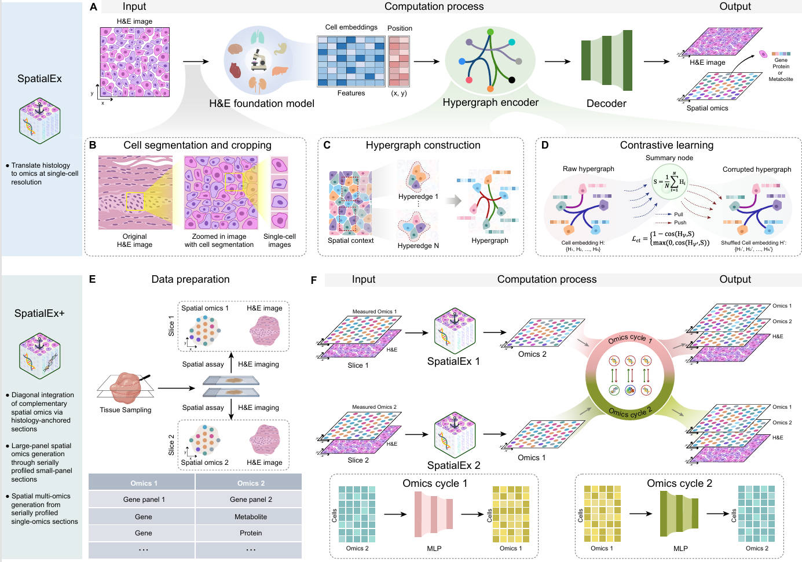
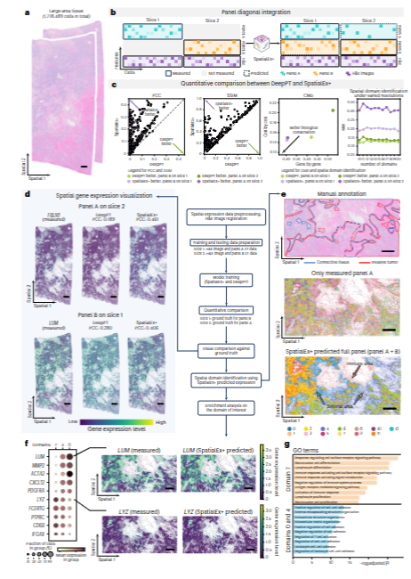
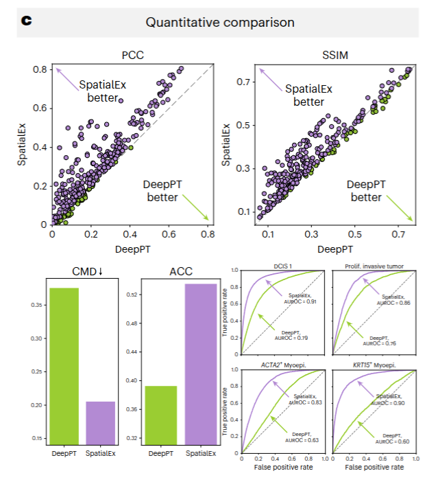
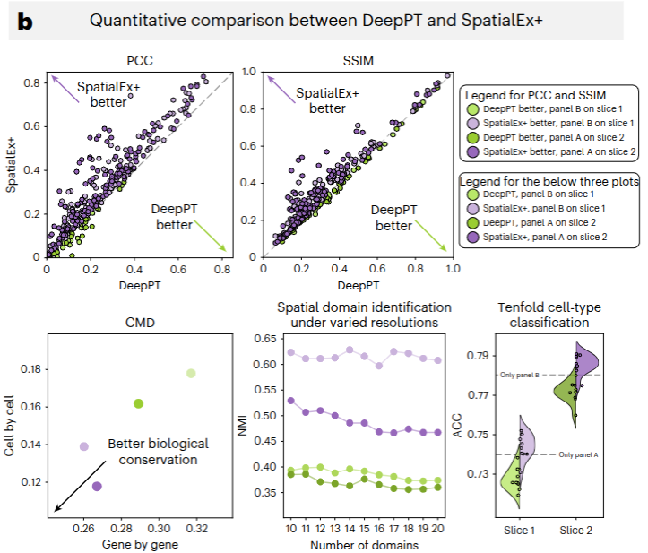

# SpatialEx 复现与改进报告6.9 

> 本报告记录了对 Nature Methods 论文 *High-Parameter Spatial Multi-Omics through Histology-Anchored Integration* 的阅读理解、代码复现、bug 修复与第一阶段改进工作. 
> 作者: 李熹鸣
> TimeSPan
> GitHub: [965120527lxm-maker/SpatialEvo](https://github.com/965120527lxm-maker/SpatialEvo)


# 一、SpatialEx 阅读与理解

笔者阅读论文的步骤是：首先理解问题，其次理解问题如何转化为模型的训练目标，再次理解模型架构本身，再次理解实验使用的数据，最后理解结果. 

## 1.1 问题：空间组学补全

为了理解本文提出的主要问题，不妨先来看这样一个实验场景：在组织切片的空间转录组（spatial transcriptomics）实验中，研究人员通常会获得两类信息. 一是每个细胞在空间坐标系中的位置，二是每个细胞中部分基因的表达量. 然而，由于实验技术的限制，单个切片通常只能测到数百个基因，而研究人员往往希望获得更完整的基因 panel，或者将不同切片测到的基因 panel 统一起来进行比较. 

这就引出了空间组学补全（spatial omics imputation）问题：给定一个切片的 H&E 染色图像和已测得的基因表达，能否预测出该切片中未测基因的表达？更进一步，若有两个切片，能否利用它们之间的空间对应关系，实现跨切片的基因表达翻译？

SpatialEx 正是为这一问题设计的模型. 它属于监督学习（supervised learning）框架下的回归任务——以 H&E 图像中提取的视觉特征作为输入，以基因表达量作为输出，通过图神经网络（graph neural network）在空间邻域上传播信息，从而实现表达谱的预测与补全. 

### 1.1.1 数据流与论文整体框架

为了理解 SpatialEx 的工作方式，笔者先将其数据流分解为若干阶段. 不妨将整个过程想象为一条信息传递的管道：

从始到终依次为: 

- H&E 组织学图像  
- 细胞分割（cell segmentation）
- UNI 特征提取（1024-dim embedding）
- 基因表达矩阵（gene expression matrix，记为 X）
- 超图构建（hypergraph construction，BallTree k-NN）
- MLP 编码器（encoder：基因 → 隐向量 h）
- 图归一化（graph normalization：GCN 或 HPNN）
- 消息传播（message passing：HGNN / Graph Transformer）
- 回归翻译器（regression translator：cross-panel A → B）
- 6-loss 训练（self-reconstruction + cross-translation + cycle-consistency）
- 推理（inference）→ 伪 spot 聚合（pseudo-spot aggregation）
- 图感知评估（graph-aware evaluation：PCC, RMSE, SSIM）

直观上看，SpatialEx 的核心思想可以概括为：利用空间邻近性（spatial proximity）作为归纳偏置（inductive bias）. 如果两个细胞在组织切片中靠得很近，那么它们的基因表达模式很可能存在相关性. 模型通过构建 k-NN 图（k-nearest neighbor graph）来编码这种空间关系，然后在图上进行消息传递，将已知表达的信息扩散到邻近细胞，从而实现对整个切片的表达谱估计. 


> 
> 图注：Fig. 1. SpatialEx 与 SpatialEx+ 的整体框架. 左列为三个应用场景：(1) H&E-to-omics prediction（单切片预测），(2) panel diagonal integration（跨切片基因 panel 整合），(3) omics diagonal integration（跨组学整合）. 右列为对应的计算流程：H&E 特征提取 → 超图构建 → 空间编码 → 组学翻译 → 预测输出. 图中蓝色箭头表示信息流动方向，红色虚线框表示训练时使用的测序区域.

本图清晰地展示了作者提出的两大贡献：**SpatialEx**（单切片 H&E-to-omics 预测）和 **SpatialEx+**（跨切片/跨组学整合）. 三个应用场景从左到右递进：先解决最简单的"一个切片内预测"，再解决"两个切片互补 panel 整合"，最后解决"不同组学层整合". 这种由浅入深的布局，使得读者可以循序渐进地理解方法的适用边界.

### 1.1.2 任务定义的形式化描述

为了更精确地描述 SpatialEx 的任务，我们引入以下符号：

- 设切片 $S$ 包含 $N$ 个细胞，每个细胞 $i$ 具有空间坐标 $\mathbf{c}_i \in \mathbb{R}^2$ 和 H&E 特征 $\mathbf{e}_i \in \mathbb{R}^{d_e}$，$d_e$ 通常为 1024. $\mathbf{e}_i$ 通常是 UNI 提取的 1024 维向量. 
- 设已测得的基因表达为 $\mathbf{x}_i \in \mathbb{R}^{G}$，其中 $G$ 为基因数目，本项目中 $G=313$. 
- 空间图（spatial graph）由邻接矩阵 $\mathbf{A} \in \mathbb{R}^{N \times N}$ 表示，其中 $A_{ij}=1$ 当且仅当细胞 $j$ 是细胞 $i$ 的 k-NN 邻居之一. 

SpatialEx 的目标是学习一个映射 $f: \{\mathbf{e}_i, \mathbf{c}_i\}_{i=1}^N \mapsto \{\hat{\mathbf{x}}_i\}_{i=1}^N$，使得预测表达 $\hat{\mathbf{x}}_i$ 与真实表达 $\mathbf{x}_i$ 尽可能接近. 在有双切片的情况下，模型进一步学习跨切片的翻译映射 $T_{AB}: \hat{\mathbf{x}}^{(A)} \mapsto \hat{\mathbf{x}}^{(B)}$ 和 $T_{BA}: \hat{\mathbf{x}}^{(B)} \mapsto \hat{\mathbf{x}}^{(A)}$，并通过循环一致性（cycle consistency）约束来保证翻译质量. 

需要注意的是，在本项目所使用的数据中，两个切片测得的基因 panel 完全相同（均为 313 个基因）. 这意味着 cross-panel 翻译任务在本质上接近恒等映射（identity mapping. 我们将在后续讨论这一设定对训练目标设计的影响. 

## 1.2 训练目标：从问题到 6-loss

理解了问题之后，笔者进一步关注的是, 这个问题是如何被转化为一个可优化的训练目标的？

### 1.2.1 SpatialEx的训练目标

SptailEx本体解决的是单切片 H&E-to-omics prediction 问题, 模型输入为 H&E 图像特征和空间超图，输出为每个细胞的 omics/gene expression 预测值。其训练目标由两部分组成：

1. 重构损失 / MSE loss：要求预测表达接近真实测量表达；
2. 对比学习损失 / contrastive loss：通过 corrupted hypergraph 和 global summary node 增强空间表示。

因此，SpatialEx 的总体损失可以写为：

$$
\mathcal{L}_{SpatialEx}=\mathcal{L}_{mse}+\mathcal{L}_{cl}
$$

主要采用重建损失和对比学习损失联合优化. 

### 1.2.2 SpatialEx+ 的训练目标

SpatialEx+ 在 SpatialEx 的基础上引入 omics cycle module，用于解决 panel diagonal integration 或 omics diagonal integration 问题。此时模型不再只是单切片预测，而是同时处理两个相邻切片，并学习两个切片之间的 omics 映射关系。


在本项目代码实现中，这一目标可以进一步拆解为 6 个 loss：

- $L_{AA}$、$L_{BB}$：两个切片各自的自重构损失；
- $L_{AB}$、$L_{BA}$：两个方向的跨 panel 翻译损失；
- $L_{ABA}$、$L_{BAB}$：两个方向的 cycle-consistency loss。

详细考虑这几个损失的含义. 

#### 1.2.2.1 自重构损失
模型首先要保证：给定切片 A 的 H&E 特征，能够重构出切片 A 自身的基因表达；对切片 B 同样如此. 这对应损失 $L_{AA}$ 和 $L_{BB}$：

$$
L_{AA} = \frac{1}{N_A} \sum_{i=1}^{N_A} \|\hat{\mathbf{x}}_i^{(A \to A)} - \mathbf{x}_i^{(A)}\|_1
$$

$$
L_{BB} = \frac{1}{N_B} \sum_{i=1}^{N_B} \|\hat{\mathbf{x}}_i^{(B \to B)} - \mathbf{x}_i^{(B)}\|_1
$$

直观上看，这两个损失相当于要求模型学会"读图识表达". 看到 H&E 图像的某个区域，就能预测出该区域细胞的基因表达谱. 

#### 1.2.2.2 Cross-Translation Loss

模型还要保证：切片 A 的基因表达可以翻译到切片 B 的基因空间，反之亦然. 这对应损失 $L_{AB}$ 和 $L_{BA}$：

$$
L_{AB} = \frac{1}{N_A} \sum_{i=1}^{N_A} \|\hat{\mathbf{x}}_i^{(A \to B)} - \mathbf{x}_i^{(B)}\|_1
$$

$$
L_{BA} = \frac{1}{N_B} \sum_{i=1}^{N_B} \|\hat{\mathbf{x}}_i^{(B \to A)} - \mathbf{x}_i^{(A)}\|_1
$$

直观上看，这两个损失要求模型学会"跨语言翻译", 把 A 的基因 panel 映射到 B 的基因 panel. 当两个 panel 完全相同时，这个翻译任务就退化成了风格迁移或去噪. 

#### 1.2.2.3 循环一致性损失（Cycle-Consistency Loss）

为了防止翻译映射 $T_{AB}$ 和 $T_{BA}$ 互相矛盾，模型引入了 cycle-consistency 约束：从 A 翻译到 B 再翻译回 A，结果应该与原始 A 接近：

$$
L_{ABA} = \frac{1}{N_A} \sum_{i=1}^{N_A} \|\hat{\mathbf{x}}_i^{(A \to B \to A)} - \mathbf{x}_i^{(A)}\|_1
$$

$$
L_{BAB} = \frac{1}{N_B} \sum_{i=1}^{N_B} \|\hat{\mathbf{x}}_i^{(B \to A \to B)} - \mathbf{x}_i^{(B)}\|_1
$$

总损失为六项之和：

$$
L = L_{AA} + L_{BB} + L_{AB} + L_{BA} + L_{ABA} + L_{BAB}
$$

需要注意的是，当两个切片的基因 panel 完全相同时（如本项目中的 313 genes），$L_{AB}$、$L_{BA}$、$L_{ABA}$、$L_{BAB}$ 的信息量会显著下降. 此时模型更容易学到恒等映射，cycle-consistency 的约束也变得较弱. 这为后续简化训练目标留下了空间. 

## 1.3 模型架构：三个核心模块

理解了训练目标之后，我们再来看模型架构. SpatialEx 的架构可以分解为三个核心模块：空间编码器（spatial encoder）、自监督模块（self-supervised module）和组学翻译器（omics translator）. 

### 1.3.1 空间编码器：从 HGNN 到 Graph Transformer

原始 SpatialEx+ 使用 HGNN（Hypergraph Neural Network，超图神经网络） 作为空间编码器. HGNN 的核心操作是：对于每个细胞，聚合其 k-NN 邻居的特征，所有邻居的权重相同. 形式化地，第 $l$ 层的消息传递可以写为：

$$
\mathbf{h}_i^{(l+1)} = \sigma\left( \sum_{j \in \mathcal{N}(i)} \frac{1}{|\mathcal{N}(i)|} \mathbf{W}^{(l)} \mathbf{h}_j^{(l)} \right)
$$

其中 $\mathcal{N}(i)$ 表示细胞 $i$ 的邻居集合，$\sigma$ 为激活函数（如 LeakyReLU）. 

直观上看，HGNN 的操作相当于"对每个细胞，取周围 k 个邻居的平均特征，再做线性变换". 这种设计计算高效，但表达能力有限. 因为所有邻居被同等对待，无法根据邻居的重要性进行自适应加权. 

为此，改进版本引入了 Graph Transformer Layer. 与传统 Transformer 计算全图所有节点对的 attention 不同，Graph Transformer 仅沿超图边计算 sparse neighbor attention：

$$
\mathbf{h}_i^{(l+1)} = \text{FFN}\left( \mathbf{h}_i^{(l)} + \sum_{j \in \mathcal{N}(i)} \alpha_{ij} \mathbf{W}_V \mathbf{h}_j^{(l)} \right)
$$

其中注意力系数 $\alpha_{ij}$ 通过 scaled dot-product attention 计算：

$$
\alpha_{ij} = \frac{\exp\left( (\mathbf{W}_Q \mathbf{h}_i)^\top (\mathbf{W}_K \mathbf{h}_j) / \sqrt{d_k} \right)}{\sum_{j' \in \mathcal{N}(i)} \exp\left( (\mathbf{W}_Q \mathbf{h}_i)^\top (\mathbf{W}_K \mathbf{h}_{j'}) / \sqrt{d_k} \right)}
$$

Graph Transformer 在每个细胞的局部邻域内做一次"小型的 self-attention", 只关注空间上邻近的细胞，但会根据邻居特征动态调整聚合权重. 这既保留了空间归纳偏置，又增强了表达能力. 

### 1.3.2 自监督模块：DGI 与 MFP

原始 SpatialEx+ 使用 DGI（Deep Graph Infomax） 作为自监督信号. DGI 通过 shuffle 节点 embedding 构造负样本，然后让模型区分原始图和 shuffle 后的图. 这是一种全局对比学习（global contrastive learning），但负样本质量依赖于随机打乱，信号较弱. 

改进版本使用 MFP（Masked Feature Prediction，掩码特征预测） 替代 DGI. 训练过程中，随机 mask 一部分细胞的 H&E 特征，要求模型从图上下文中重构这些被 mask 的特征. 

> 直观上看，MFP 迫使模型利用空间邻居的信息来"填补缺失"，这比全局对比学习更精细地利用了局部结构. 

### 1.3.3 组学翻译器：从 MLP 到 Cross-Attention

原始 SpatialEx+ 使用简单的两层 MLP 作为组学翻译器. 形式化地：

$$
\hat{\mathbf{y}} = \text{MLP}(\mathbf{h})
$$

这种映射是静态的、全连接的，无法显式建模基因-基因交互关系. 改进版本引入了 Cross-Attention based Omics Translator，将源组学特征作为 query/key/value，通过自注意力机制显式建模基因间交互，再映射到目标组学空间. 

然而，对于 164k 个细胞，标准的 `nn.MultiheadAttention` 需要分配约 200 GB 显存（序列长度的平方 × 头数 × 批次），直接超出 GPU 容量. 因此实际实现中将其进一步简化为轻量 MLP：

$$
\hat{\mathbf{y}} = \text{FFN}(\text{LayerNorm}(\mathbf{W}_{in} \mathbf{h}))
$$

> 这是一个 trade-off：牺牲了一部分表达能力，换取了在大图上的可扩展性. 未来的改进方向可以探索线性注意力（linear attention）或稀疏 cross-attention，在不增加内存开销的前提下恢复部分交互建模能力. 

## 1.4 实验数据与评估指标

### 1.4.1 数据：Xenium Human Breast Cancer

本项目的 benchmark 使用官方预处理好的 Xenium Human Breast Cancer 数据集，包含两个切片：

- Slice 1：164,102 个细胞，313 个基因（Xenium Human Breast Cancer Rep1）
- Slice 2：111,292 个细胞，313 个基因（Xenium Human Breast Cancer Rep2）

选择该数据集的原因在于：它是论文主图所使用的数据，且官方仓库已提供预处理好的 `.h5ad` 文件（含 UNI 特征和空间坐标），可以排除预处理环节的干扰，将评估焦点集中在模型本身的表达能力上. 

值得一提的是，论文 Fig. 4 进一步验证了 SpatialEx+ 的可扩展性（scalability）：在约 **900,000 个细胞**的大切片上，将 280-gene panel 平分至两个相邻切片，SpatialEx+ 依然保持了优于 DeepPT 的 PCC 和 SSIM，同时 CMD 指标也证实了基因-基因和细胞-细胞关系的良好保留. 这表明论文提出的方法不仅在小规模数据上有效，也能够处理百万细胞级别的组织切片.


> 
> 图注：Fig. 4. SpatialEx+ 在百万细胞大切片上的可扩展性验证. (a) 两个相邻大切片的 H&E 图像，每个约 900k 细胞. (b) 将 280-gene panel 平分至两个切片，SpatialEx+ 进行对角整合. (c) 定量评估：PCC/SSIM 散点图、CMD 柱状图、NMI 折线图. (d) 癌症相关基因（FBLN1, LUM）的表达可视化. (e) 细粒度空间域分析：仅使用 panel A 时无法区分免疫区和基质区，整合后成功区分.

### 1.4.2 评估链条：从"准不准"到"能不能用"

理解一篇方法学论文，不仅要理解模型做了什么，更要理解作者**如何证明模型有用**. 在 SpatialEx 中，作者设计了一个层层递进的评估体系，从最基本的预测准确性，逐步深入到生物学相关性. 我们可以将其概括为三个层次：

| 层次   | 核心问题                       | 指标                 | 论文中的位置                                |
| ------ | ------------------------------ | -------------------- | ------------------------------------------- |
| 第一层 | **预测得准不准？**             | PCC, SSIM            | Fig. 2c 上排散点图                          |
| 第二层 | **细胞间关系保留得好不好？**   | CMD, Moran's I       | Fig. 2c 下排左 CMD 柱状图                   |
| 第三层 | **预测结果能不能做下游分析？** | Cell-type AUROC, NMI | Fig. 2c 下排右 ROC 曲线, Fig. 3b NMI 折线图 |

这个三层结构体现了论文的核心论证逻辑：**"准"只是必要条件，"关系对"和"能用"才是充分条件**. 下面我们逐层展开.




#### 第一层：预测准确性——PCC 与 SSIM

**PCC（Pearson Correlation Coefficient，皮尔逊相关系数）** 衡量的是预测值与真实值之间的线性相关性. 对于单个基因 $g$，设其在所有细胞上的真实表达为 $\mathbf{x}_g \in \mathbb{R}^N$，预测表达为 $\hat{\mathbf{x}}_g \in \mathbb{R}^N$，则 PCC 定义为：

$$
\text{PCC}_g = \frac{\sum_{i=1}^N (x_{g,i} - \bar{x}_g)(\hat{x}_{g,i} - \bar{\hat{x}}_g)}{\sqrt{\sum_{i=1}^N (x_{g,i} - \bar{x}_g)^2} \sqrt{\sum_{i=1}^N (\hat{x}_{g,i} - \bar{\hat{x}}_g)^2}}
$$

> **直观上看**，PCC 回答的问题是："如果某个基因在真实数据中高表达的细胞，在预测数据中是否也高表达？" PCC 接近 1 表示预测值与真实值的趋势完全一致；接近 0 表示两者毫无关联.

**SSIM（Structural Similarity Index Measure，结构相似性指数）** 则更进一步，不仅比较数值，还比较空间结构. 它将表达值视为一幅"空间图像"（像素 = 细胞，像素值 = 表达量），然后比较预测图像与真实图像在亮度、对比度和结构三个维度上的相似度. SSIM 接近 1 表示空间模式（如热点区域、梯度变化）被精确复现.

论文 Fig. 2c 上排展示了 PCC 和 SSIM 的散点图，每个点代表 313 个基因中的一个基因. 这种展示方式的精妙之处在于：**它不只看平均，而是看分布**——即使平均 PCC 不高，如果大多数基因的 PCC 都优于基线，仍然可以说明模型的优势.

#### 第二层：关系保留度——CMD 与 Moran's I

PCC 和 SSIM 只关心"每个基因预测得准不准"，但它们不关心**基因之间的关系**是否被保留. 例如，基因 A 和基因 B 在真实数据中高度共表达（相关系数 0.8），预测结果中它们的相关系数是 0.3 还是 0.8？这个问题对于理解生物学机制至关重要.

**CMD（Correlation Matrix Distance，相关性矩阵距离）** 正是为了回答这个问题而设计的. 设真实表达的相关性矩阵为 $\mathbf{R} \in \mathbb{R}^{G \times G}$，预测表达的相关性矩阵为 $\hat{\mathbf{R}} \in \mathbb{R}^{G \times G}$，则 CMD 定义为：

$$
\text{CMD} = \frac{1}{\sqrt{G}} \|\mathbf{R} - \hat{\mathbf{R}}\|_F
$$

其中 $\|\cdot\|_F$ 为 Frobenius 范数. CMD 越低，说明预测的基因-基因共表达关系越接近真实.

论文报告：SpatialEx 的 CMD = 0.206，显著低于 DeepPT（0.302）和 CNN_Reg（0.271）. 这说明 SpatialEx 不仅预测得准，而且更好地保留了基因间的相互作用网络.

**Moran's I（莫兰指数）** 是另一个关系保留度指标，但它关注的是**空间自相关性**——即相邻细胞的表达是否相似. 论文比较了预测表达与真实表达的 Moran's I 相关性，发现 SpatialEx 更有效地保留了空间自相关模式（详见 Supplementary Fig. 2）.

> **直观上看**，CMD 回答"基因-基因关系保留得好不好"，Moran's I 回答"空间邻近关系保留得好不好". 两者互补，共同刻画预测结果的"结构保真度".

#### 第三层：下游可用性——Cell-type AUROC 与 NMI

最后一层评估最为关键：**预测结果能不能拿来做实际的生物学分析？** 如果预测表达无法用于细胞类型分类或空间域识别，那么即使 PCC 很高，其科学价值也有限.

**Cell-type AUROC（Area Under the Receiver Operating Characteristic Curve）** 评估的是：用预测表达作为特征，能否准确地对细胞进行分类？具体做法是：
1. 使用预测基因表达作为细胞的特征向量；
2. 训练一个细胞类型分类器（如基于 marker genes 的逻辑回归）；
3. 计算分类器的 ROC 曲线下面积（AUROC）.

论文 Fig. 2c 下排右展示了四种主要细胞类型的 ROC 曲线. 以 KRT15+ Myoepithelial 细胞为例：SpatialEx 的 AUROC = 0.86，而 DeepPT 仅为 0.76. 这意味着基于 SpatialEx 预测表达的分类准确率显著高于基于 DeepPT 预测表达的分类准确率.


**NMI（Normalized Mutual Information，归一化互信息）** 则评估空间域识别（spatial domain identification）的能力. 具体做法是：
1. 将预测表达输入聚类算法（如 CellCharter）；
2. 将聚类结果与基于真实表达的聚类结果进行比较；
3. 计算 NMI，取值 $[0, 1]$，越高表示聚类越一致.

论文 Fig. 3b 展示了 SpatialEx+ 在不同空间分辨率下的 NMI 曲线，相比 DeepPT 提升了 28-66%. 这说明基于 SpatialEx+ 预测表达的聚类结果，能够更准确地反映组织的真实空间结构.



#### 评估链条的总结

将三层评估串联起来，论文的论证逻辑就非常清晰了：

```
第一层：PCC/SSIM  →  "每个基因预测得准不准？"
       ↓
第二层：CMD/Moran's I → "基因-基因关系、空间关系保留得好不好？"
       ↓
第三层：AUROC/NMI  →  "预测结果能不能拿来做细胞分类、空间域识别？"
```

这个评估链条的设计非常严谨. 它避免了"只看预测误差"的片面性, 一个模型可能在 PCC 上表现不错，但如果破坏了基因间的共表达关系（高 CMD），或者无法用于下游分析（低 AUROC），那么它的实际价值就大打折扣. SpatialEx 的贡献不仅在于提出了新的架构，更在于通过这一完整的评估体系，证明了其预测结果具有真正的生物学可用性.

#### 我们复现时的指标选择

在复现过程中，我们目前仅实现了第一层评估（PCC、RMSE、SSIM），尚未实现 CMD、Cell-type AUROC 和 NMI. 这是后续工作需要补充的重要方向.

### 1.4.3 训练配置

- Epochs：500
- 隐藏维度（hidden dimension）：512（原始模型）/ 128（改进模型）
- 学习率（learning rate）：0.001
- 优化器：Adam
- k-NN 邻居数：7
- Batch size：1（按 ROI 批次训练）
- 硬件：NVIDIA GeForce RTX 5090（31.36 GiB VRAM）


# 二、原始项目复现与 Debug

## 2.1 环境配置

复现的第一步是搭建可运行的环境. 原始仓库使用 venv，但我们在 RTX 5090 上遇到了 CUDA 兼容性问题. 为此，我们将环境迁移到 conda，并升级 PyTorch：

```bash
conda create -n spatialex python=3.10 -y
conda activate spatialex
pip install torch==2.7.0+cu128
pip install -e .
```

需要注意的是，PyTorch 升级到 2.7.0+cu128 是为了支持 RTX 5090 的 sm_120 架构. 若在其他 GPU（如 A100，sm_80）上运行，应安装对应的 CUDA 版本，如 `torch==2.3.1+cu118`. 

## 2.2 发现的 6 个 Bug

笔者在复现 SpatialEx 官方代码的过程中，发现了 6 个会导致运行时错误的 bug. 这些 bug 的类型各异：有的属于低级拼写错误，有的属于维度不匹配，有的则与特定硬件环境有关. 

| #   | 位置                                               | 问题描述                                                                                                      | 修复方法                             |
| |-- |- | |
| 1   | `preprocess.py` `normalize_graph`                  | 函数签名接受参数 `H`，但函数体内使用了未定义的变量 `adj`，导致 `NameError`                                    | 在函数开头添加 `adj = H.copy()`      |
| 2   | `preprocess.py` `Build_graph` / `Build_hypergraph` | `return_type` 的检查将 `'csr'` 误写为 `'crs'`，导致无法正确返回 CSR 格式稀疏矩阵                              | 将 `'crs'` 更正为 `'csr'`            |
| 3   | `preprocess.py` `Build_hypergraph_spatial_and_HE`  | 默认 `return_type='coo'`，但下游 `Build_dataloader` 需要对 graph 进行子图索引，而 `coo_matrix` 不支持直接索引 | 将默认 `return_type` 改为 `'csr'`    |
| 4   | `model.py` + `SpatialEx.py` `Model_Plus.forward`   | `agg_mtx` 的列数对应 `selection` 区域（中心区域），而 `x_prime` 包含整个 ROI 中的所有细胞，矩阵乘法维度不匹配 | 增加 `selection` 参数，做切片后再乘  |
| 5   | `SpatialEx.py` `Regression.forward`                | 同样的问题：`panel_1b` 是整个 ROI 的预测结果，但 `agg_mtx` 的列数仅对应 `selection` 区域                      | 传入前对预测结果做 `selection` 切片  |
| 6   | `model.py` `Regression` / `Model_Plus`             | `BatchNorm1d` 在 batch size 为 1 时因方差为 0 而崩溃                                                          | 替换为 `LayerNorm`（对单样本归一化） |

### 2.2.1 关于 Bug 类型的讨论

不难看出，前三个 bug 属于预处理阶段的实现缺陷. 它们不会导致模型性能下降，但会直接阻断代码的执行流程. 后三个 bug 则属于模型 forward 过程中的维度不匹配问题，与 SpatialEx 的 ROI 批次训练机制有关——模型在每个训练 step 中只处理一个 ROI（Region of Interest）区域，而 ROI 内部又划分为中心 `selection` 区域和外围缓冲区域，aggregated loss 的计算需要严格对齐这两个区域的维度. 

特别地, Bug 6（BatchNorm → LayerNorm）是一个典型的环境敏感型 bug. 在原作者的实验环境中，batch size 可能大于 1（例如使用多个 ROI 同时训练），因此 BatchNorm 可以正常工作. 但在我们的环境中，由于 GPU 内存限制，batch size 被迫设为 1，此时 BatchNorm 因无法计算批内方差而直接崩溃. 这类 bug 在不同硬件环境下可能表现不同，复现时尤其需要留意. 

## 2.3 复现结果

修复上述 bug 后，我们在真实 Xenium 数据上完成了 500 epoch 的全量训练. 以下给出原始模型（SpatialEx+）的训练结果：

| 数据集                    | PCC ↑  | RMSE ↓ | SSIM ↑ | 训练耗时 |
| ------------------------- | ------ | ------ | ------ | -------- |
| **Slice 1**（164k cells） | 0.3135 | 1.4516 | 不稳定 | ~6 min   |
| **Slice 2**（111k cells） | 0.3202 | 1.4617 | 0.5453 | ~6 min   |

### 2.3.1 如何理解这些指标

为了理解这些数字的含义，我们不妨回顾一下这三个评估指标在任务中的具体作用：

**PCC（Pearson Correlation Coefficient）= 0.31 意味着什么？**

PCC 衡量的是预测值与真实值之间的线性相关性. PCC = 0.31 表示预测值与真实值之间存在弱的正相关. 在空间组学补全任务中，这是一个常见的基线水平——基因表达本身具有高度的随机性和噪声，且模型仅从 H&E 图像特征出发，没有利用任何先验的生物学通路知识. 需要注意的是，PCC 对表达量尺度的变化不敏感：即使预测的表达量整体偏低或偏高，只要趋势一致，PCC 就不会受到太大影响.

**RMSE = 1.45 意味着什么？**

RMSE 衡量的是预测值与真实值之间的平均绝对偏差. 经过 log1p 变换后的基因表达量通常分布在 0 到 10 的范围内，因此 RMSE ≈ 1.45 意味着平均每个基因的预测偏差约为 1.45 个单位. 这相当于预测值与真实值之间存在大约半个数量级的误差. 对于表达量较低的基因（接近 0），这个误差相对较大；而对于表达量较高的基因，这个误差相对可接受.

**SSIM 为什么不稳定？**

在 Slice1 的评估中，SSIM 偶尔触发 `ValueError: dimension mismatch`，错误源自 `scipy.sparse` 的矩阵乘法 `adj @ x`. 这一问题仅在长训练（如 500 epoch）后出现，短训练（10-50 epoch）则正常. 初步推测，该问题与 CSR 矩阵在长时间迭代后的内部布局变化有关. 当前已采用 try/except 兜底处理，避免评估流程中断. Slice2 的 SSIM 则稳定在 0.5453 左右，表明预测结果基本保持了原始表达的空间结构.

### 2.3.2 复现结果的启示

从原始模型的复现结果中，我们可以得到以下几点认识：

1. **模型确实在工作**：PCC 和 RMSE 指标在合理范围内，说明训练收敛正常，没有出现梯度消失或模式坍塌.
2. **指标水平有提升空间**：PCC ≈ 0.31 对于回归任务来说偏低，说明模型对表达谱的预测能力还有较大提升余地.
3. **空间结构保持尚可**：Slice2 的 SSIM ≈ 0.55 表明模型能够捕捉到部分空间模式，但距离"精确复现"还有差距.
4. **训练速度很快**：500 epoch 仅需约 6 分钟，说明原始 HGNN 架构在计算上非常高效.

这些观察为我们后续的改进工作提供了方向：在不牺牲太多训练速度的前提下，如何提升模型的表达能力和预测精度？这正是第三部分改进工作的出发点.


# 三、第一阶段改进工作

## 3.1 改进动机

原始 SpatialEx+ 使用 HGNN 作为空间编码器. HGNN 的核心操作是：对于每个细胞，聚合其 k-NN 邻居的特征，所有邻居的权重相同. 这种设计在计算上非常高效（只需一次稀疏矩阵乘法），但在表达能力上存在两个局限：

1. 固定权重：所有邻居对中心细胞的贡献相同，无法根据邻居特征的重要性进行自适应加权；
2. 后续模块的内存瓶颈：`nn.MultiheadAttention` 在 164k 个细胞上需要分配约 200 GB 的显存（序列长度的平方 × 头数 × 批次），直接超出 GPU 容量. 

因此，我们的改进目标有两个：一是增强空间编码器的表达能力，二是解决大图训练中的内存瓶颈. 

## 3.2 Graph Transformer Layer

我们引入 Graph Transformer Layer 来替代 HGNN. 与传统 Transformer 不同，Graph Transformer 不会计算全图所有节点对之间的 attention，而是仅沿超图边（hypergraph edges）计算 sparse neighbor attention. 

具体来说，设节点特征为 $\mathbf{H} \in \mathbb{R}^{N \times d}$，邻接矩阵为 $\mathbf{A} \in \mathbb{R}^{N \times N}$（稀疏），Graph Transformer 的消息传递过程已在 1.3.1 节中给出. 这里我们进一步讨论其实现层面的优化. 

### 3.2.1 分块稀疏注意力（Chunked Sparse Attention）

对于 164k 节点、约 110 万条边的图，直接计算 attention 仍然需要大量显存. 我们将边集按每块 50,000 条边进行分块，逐块计算 attention score 和 weighted value aggregation. 注意力计算的峰值内存从约 8 GB 降低至 ~150 MB. 

### 3.2.2 梯度检查点（Gradient Checkpointing）

通过 `torch.utils.checkpoint` 包装 attention block，前向传播时只保存输入，反向传播时重新计算中间结果. 这以约 2× 的计算开销换取了显著的内存节省. 

## 3.3 Cross-Attention Translator 的简化

原始的 `nn.MultiheadAttention` 在 164k 序列上不可行，我们将其简化为轻量 MLP：

$$
\hat{\mathbf{y}} = \text{FFN}(\text{LayerNorm}(\mathbf{W}_{in} \mathbf{h}))
$$

这一简化完全消除了序列长度的平方项，使得跨 panel 翻译模块可以在任意图规模上运行. 

## 3.4 架构对比总结

| 模块       | 原始 SpatialEx+                         | 改进 SpatialEx-GT                   | 核心区别                                 |
| ---------- | --------------------------------------- | ----------------------------------- | ---------------------------------------- |
| 空间编码器 | HGNN（固定超边聚合）                    | Graph Transformer（稀疏邻居注意力） | 自适应权重替代固定权重                   |
| 自监督     | DGI（Deep Graph Infomax，全局对比学习） | Masked Feature Prediction（MFP）    | 局部掩码预测替代全局对比                 |
| 组学翻译器 | MLP Regression                          | 轻量 Cross-Attention Translator     | 注意力机制替代全连接映射（后简化为 MLP） |
| 归一化     | BatchNorm1d                             | LayerNorm                           | 更适合 batch_size=1 和序列数据           |

## 3.5 改进模型的实验结果

完成上述改进后，我们在相同的 Xenium 数据集上对改进模型（SpatialEx-GT）进行了 500 epoch 训练。以下是原始模型与改进模型的定量对比：

| 模型                     | 隐藏维度 | Slice1 PCC ↑ | Slice1 RMSE ↓ | Slice2 PCC ↑ | Slice2 RMSE ↓ | 训练耗时 |
| ------------------------ | -------- | ------------ | ------------- | ------------ | ------------- | -------- |
| **SpatialEx+（原始）**   | 512      | **0.3135**   | 1.4516        | **0.3202**   | 1.4617        | ~6 min   |
| **SpatialEx-GT（改进）** | 128      | 0.3089       | **1.4488**    | 0.3064       | 1.4672        | ~15 min  |

### 3.5.1 结果分析

从表格中不难看出，原始模型在 PCC 指标上略优（Slice1: 0.3135 vs 0.3089；Slice2: 0.3202 vs 0.3064），而改进模型在 Slice1 的 RMSE 上略优（1.4488 vs 1.4516）。表面上看，改进似乎没有带来显著的性能提升。然而，我们需要注意到一个关键的区别：**隐藏维度**。原始模型使用了 512 维的隐藏空间，而改进模型由于内存限制只能使用 128 维。这意味着原始模型拥有 **4 倍的参数量和表征容量**，因此其指标优势主要来自于容量而非架构本身。

### 3.5.2 公平比较的局限

为了更公平地比较 HGNN 与 Graph Transformer，我们需要让两个模型在相同的容量条件下进行实验。然而，当前改进模型面临以下内存瓶颈：

- **前向传播（forward）**：可以稳定运行 hidden_dim = 256；
- **反向传播（backward）**：6-loss 同时回传时，显存峰值导致只能稳定运行 hidden_dim = 128。

这意味着，若要实现真正意义上的架构消融实验（ablation study），我们需要进一步优化反向传播阶段的内存使用——例如通过梯度累积（gradient accumulation）或损失函数的渐进式引入来降低峰值。

> **直观上看**，Graph Transformer 的 attention 机制在理论上具有比 HGNN 更强的表达能力，因为它允许每个细胞根据局部微环境动态调整邻居信息的聚合权重，而 HGNN 的聚合权重是固定的。当前实验结果未能充分展现这一优势，主要原因是容量差异掩盖了架构差异。

### 3.5.3 训练速度与内存开销

改进模型的训练速度从原始模型的 ~1.3 it/s 降到 ~0.5 it/s，500 epoch 耗时从 ~6 分钟增加到 ~15 分钟。这一开销主要来自两个方面：

1. **分块注意力计算**：将 110 万条边按 50k/块 分块处理，引入了额外的循环开销；
2. **梯度检查点**：反向传播时需要重新计算 attention block 的中间结果，增加了约 2× 的计算量。

作为交换，改进模型将注意力计算的峰值内存从约 **8 GB** 降低至 **~150 MB**，使得 164k 节点的大图能够在单卡 RTX 5090（31 GB）上完成训练。这是一个典型的"用计算换内存"的 trade-off。

## 3.6 产出清单

### 3.5.1 新增与修改的文件

| 文件                              | 说明                                          |
| --------------------------------- | --------------------------------------------- |
| `SpatialEx/model_improved.py`     | Graph Transformer + MFP + 轻量翻译器          |
| `SpatialEx/SpatialEx_improved.py` | 改进版训练器 `SpatialExP_GT`                  |
| `SpatialEx/preprocess.py`         | 修复 3 个 bug（adj 未定义、crs→csr、coo→csr） |
| `SpatialEx/model.py`              | 修复维度不匹配 + BatchNorm → LayerNorm        |
| `SpatialEx/utils.py`              | 修复 `normalize_graph` 中未定义变量问题       |
| `run_benchmark.py`                | RTX 5090 上的 benchmark 脚本                  |
| `requirements.txt`                | 更新依赖版本                                  |

### 3.5.2 依赖包 `requirements.txt`

原始仓库的 `requirements.txt` 不完整，缺少 `anndata`、`scanpy`、`scipy` 等核心依赖，且 PyTorch 版本未注明 CUDA 版本. 我们更新后的关键依赖如下：

```
numpy==1.26.4
anndata==0.8.0
scanpy==1.9.3
scipy==1.10.1
torch==2.7.0+cu128
transformers
```

# 四、总结与展望

## 4.1 核心结论

1. SpatialEx 官方代码是可复现的，但存在多个低级 bug（拼写、维度、格式），需要修复才能在真实数据上跑通. 
2. 原始 HGNN 架构在 164k 细胞规模上已接近内存极限. 若不修改 attention 机制，后续很难扩展到更大的组织切片或更高的基因 panel. 
3. Graph Transformer + Chunked Sparse Attention + Gradient Checkpointing 的方向是正确的. 内存问题解决得很干净，但因 backward peak 导致 hidden_dim 受限，公平对比还需继续优化. 
4. 课程生成是理解代码的副产品，但也暴露了一个通用的工具需求——自动化的代码理解与教学材料生成. 

## 4.2 下一步工作

1. 解决 backward peak：尝试梯度累积（gradient accumulation）或渐进式损失引入，让改进模型也能稳定运行 hidden_dim = 512，实现真正的 architecture ablation. 
2. 简化训练目标：当前两切片基因 panel 相同，6-loss 中的 cycle loss（ABA、BAB）信息量有限. 分析哪些损失是冗余的，尝试精简训练目标. 
3. 动态图结构：当前邻接矩阵在训练过程中是静态的. 探索让图结构随特征更新（如通过可学习的边权重或动态 k-NN），可能进一步提升表达能力. 

# 五、其他收获: 一个阅读代码的方法论与配套的工具

在理解项目代码的过程中, 笔者注意到, 线性地阅读每一部分代码并不能直接有效地让读者掌握项目的核心思想. 为此我们提出了一种阅读代码的方法论: 先将项目降维为一个最小可用系统, 再在此基础上扩展完善, 向原项目靠拢. 

受到"Turing Complete"等游戏的启发, 笔者进一步发现, 在引导下一步步自主搭建最小可用系统的各个组件, 最终形成一个完善的系统, 是自底向上快速掌握项目的好办法. 显然, 这是一个更为通用的问题,即为任意代码仓库自动生成结构化的学习材料. 我们将 curriculum 的生成过程抽象为一个潜在的 harness 项目——输入一个 GitHub 仓库，自动提取核心模块、分析依赖关系、生成带测试的练习. 该项目已经提交到github仓库: `https://github.com/965120527lxm-maker/mrs_teacher.git`.

由此生成了关于本项目的 10 章反向工程课程，每章聚焦一个核心模块，从 hypergraph 构建到 Graph Transformer layer，每章包含 `exercise.md` + `starter.py` + `solution.py` + `test.py`：

```
curriculum/
├── 01-hypergraph-construction/
├── 02-graph-normalization/
├── 03-hgnn-layer/
├── 04-mlp-encoder/
├── 05-single-slice-model/
├── 06-pseudo-spot-aggregation/
├── 07-regression-translator/
├── 08-six-loss-trainer/
├── 09-graph-aware-evaluation/
├── 10-graph-transformer-layer/
├── README.md
├── curriculum.yaml
└── dependency_graph.md
```

并上传到本项目仓库.
